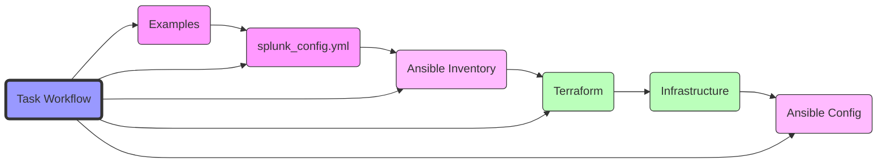

# Splunk Platform Automator

[](#license)

Ever wanted to build a complex Splunk environment for testing, which looks as close as possible to a production deployment? Need to test a Splunk upgrade? See how Splunk indexer- or search head clustering works? Or just need to verify some configuration changes? This is the right place for you! The aim of this framework is to produce a Splunk environment in a fast and convenient way for testing purposes or maybe also for production use. The created Splunk installation and setup follows best practices.

This repository is a modernization of the infrastructure layer of the original [Splunk Platform Automator](https://github.com/splunk/splunk-platform-automator), replacing Vagrant with Terraform while maintaining the robust Ansible-based Splunk configuration and deployment.

## Table of Contents

- [Features](#features)
- [Architecture](#architecture)
- [Installation](#installation)
- [Usage](#usage)
- [Host Management](#host-management)
- [Support](#support)
- [Project Status](#project-status)
- [License](#license)

# Features

- Single Source of Truth: All environment configuration defined in one `splunk_config.yml` file
- Modern Infrastructure Layer:
  - Terraform-based infrastructure provisioning
  - OrbStack virtualization optimized for ARM-based macOS
  - Future AWS support planned
- Automated Workflow:
  - Task-based automation for all operations
  - Integrated validation and testing
  - Seamless deployment pipeline
- Configuration Management:
  - Preserves original Ansible-based Splunk configuration
  - Supports all Splunk Enterprise roles
  - Best practice configurations maintained

# Architecture



# Installation

1. Make sure you have Python 3.6+ installed
2. Install required packages:
   ```bash
   python -m pip install jmespath  # required for json_query calls
   python -m pip install lxml      # required for license file checks
   ```
3. Install Ansible: `brew install ansible`
4. Install Terraform: `brew install terraform`
5. Setup environment:
   ```bash
   task setup-venv              # Create virtual environment
   . ./.venv/bin/activate      # Activate environment
   task setup:deps             # Install dependencies
   ```

# Usage

## Available Commands

### Infrastructure Management
```bash
# Initialize and Plan
task tf:init         # Initialize Terraform working directory
task tf:validate     # Validate Terraform configurations
task tf:plan         # Plan infrastructure changes

# Apply and Destroy
task tf:apply        # Apply infrastructure changes
task tf:destroy      # Destroy infrastructure (interactive)
task tf:destroy-auto # Destroy infrastructure (non-interactive)
```

### Configuration Management
```bash
task ansible:validate:config    # Validate configuration
task ansible:generate:inventory # Generate Ansible inventory
task ansible:deploy            # Deploy Splunk configuration
```

### Example Management
```bash
task example:list     # List available examples
task example:use      # Use an example configuration
task example:restore  # Restore previous configuration
```

### End-to-end Workflows
```bash
task deploy          # Deploy complete infrastructure and configure Splunk
task destroy:all     # Destroy all infrastructure and clean up
```

## Quick Start

```bash
task example:list           # View available examples
task example:use -- idx_3shc_uf_orbstack  # Use example config
task deploy                # Deploy infrastructure and Splunk
```

# Host Management

## Using Terraform (Recommended)
When using Terraform for infrastructure provisioning, host management is handled automatically:
- Terraform generates the `inventory/hosts` file during infrastructure provisioning
- Host entries are automatically managed based on your `splunk_config.yml`
- This is handled when running `task tf:apply`

## Manual Provisioning
For scenarios where you're manually managing VMs (e.g., manually created OrbStack machines):

1. Set up your configuration:
   ```bash
   # Copy and modify an example configuration
   cp examples/idx_sh_uf_orbstack.yml config/splunk_config.yml
   ```

2. Create your VMs in OrbStack matching the names in your configuration:
   ```bash
   orb create almalinux:9 idx1
   orb create almalinux:9 sh1
   orb create almalinux:9 uf1
   ```

3. Generate and set the inventory:
   ```bash
   task orb:inventory > inventory/hosts
   ```

4. Deploy Splunk:
   ```bash
   task ansible:deploy
   ```

Example `inventory/hosts` format:
```
# Generated by orb:inventory - Host configurations
idx1 ip_addr=198.19.249.75 public_dns_name=idx1.orb.local
sh1 ip_addr=198.19.249.134 public_dns_name=sh1.orb.local
uf1 ip_addr=198.19.249.177 public_dns_name=uf1.orb.local
```

# Support

**Note: This framework is not officially supported by Splunk. It is being developed on best effort basis.**

# Project Status

## Current Sprint: Improving Manual Provisioning
- Simplified host management by consolidating all host information in inventory/hosts file
- Removed redundant host mapping functionality
- Streamlined manual provisioning process for better user experience

## Previous Sprints

### Sprint 3 (October 2024)
- [c] Terraform module for OrbStack Linux machines
- [c] Development and production environment setup
- [c] Basic Ansible inventory generation
- [c] Host file management system

### Sprint 2 (September-October 2024)
- [c] Task-based infrastructure management
- [c] Example configurations for OrbStack
- [c] Basic configuration validation
- [c] Infrastructure state verification

### Sprint 1 (September 2024)
- [c] Project initialization
- [c] Basic project structure
- [c] Initial documentation
- [c] Basic OrbStack integration

## Planned Features
### Next Sprint Priority
- [p] AWS/vSphere provider implementation
  - AWS EC2 instance management
  - vSphere VM provisioning
  - Provider-specific networking
  - Security group configuration
  - Environment-specific provider configurations
- [p] Cross-provider configuration templates
- [p] Enhanced environment management
  - Cross-environment resource sharing
  - Environment isolation controls
  - Resource tagging by environment

### Future Roadmap
- [d] Enhanced logging and monitoring
- [d] Automated testing pipeline
- [d] Container support
- [d] Additional cloud provider support (Azure, GCP)

Legend:
- [c] Completed
- [p] Planned (Current/Next Sprint)
- [d] Deferred (Future Roadmap)

# License

Apache License 2.0
