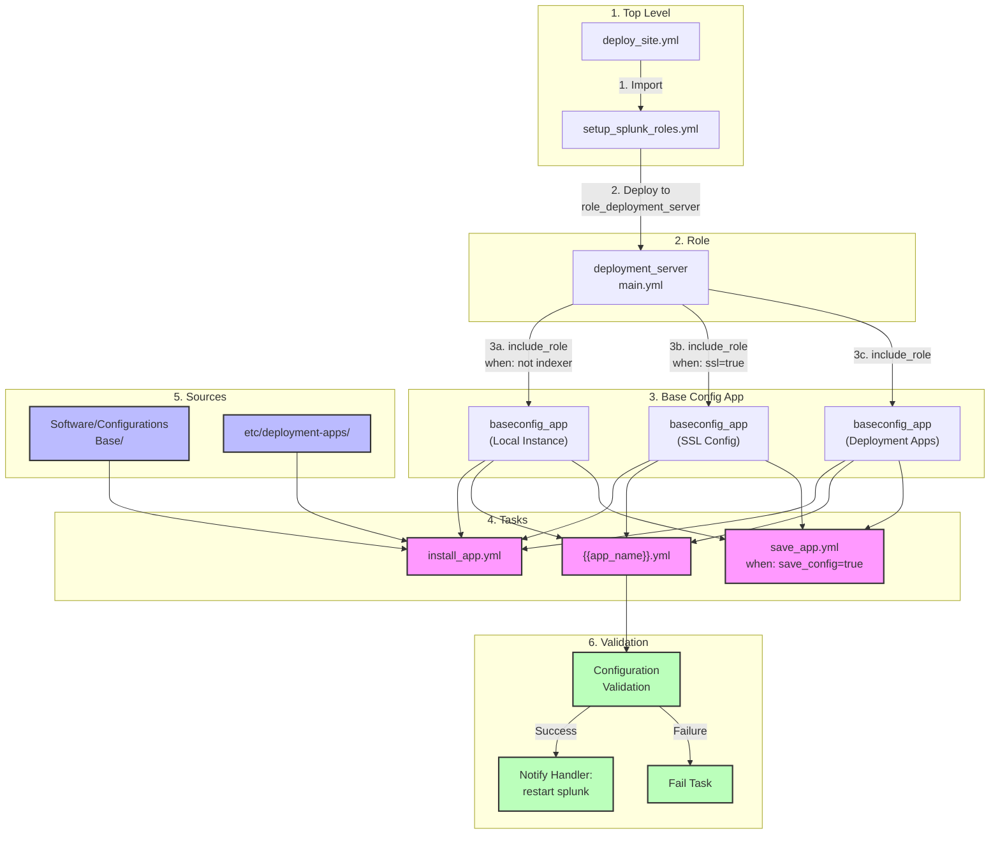

# Splunk Platform Automator Configuration Flow

This document provides a detailed explanation of how configurations flow through the system using real examples from our deployment. The flow described here specifically follows the execution path for the host `dpl@orb`, which serves as our deployment server. While the overall playbook handles multiple roles and hosts, this documentation focuses on the deployment server's configuration process, as it is responsible for distributing configurations to other Splunk components.

## 1. Host Context

```yaml
# Host-specific details
ansible_host: dpl@orb
role: deployment_server
environment: splk

# Key responsibilities
- Manages configuration distribution
- Serves as deployment server for forwarders
- Handles SSL certificate distribution
- Processes and validates configurations
```

## 2. Environment Structure

Our environment consists of:

```yaml
# Key Components
- Deployment Server (dpl)
- Indexers (idx)
- Search Heads (sh1, sh2, sh3)
- Universal Forwarder (uf)
```

## 3. Data Sources

### A. Inventory Groups

```yaml
# Relevant groups from inventory
role_deployment_server:
  hosts:
    dpl:                  # Our deployment server
role_indexer:
  hosts:
    idx:                  # Our indexer
output_splk_all:         # Hosts that need forwarder outputs
  hosts:
    dpl:
    sh1:
    sh2:
    sh3:
    uf:
```

### B. Host Variables (dpl example)

```yaml
dpl:
  ansible_host: ansible@dpl@orb
  splunk_env_name: splk
  splunk_output_list:
    indexer:
      - idx              # Points to our indexer
  splunk_outputs: all    # This host gets all outputs
```

## 4. Configuration Flow

### Role Calling Hierarchy

The diagram below illustrates the complete flow of how Ansible roles and tasks interact to deploy Splunk configurations. The process begins with the top-level playbook and flows through various roles and tasks, with each step performing specific configuration actions. The code examples following the diagram demonstrate the actual implementation of each step.



#### Step 1: Top Level Playbook

```yaml
# deploy_site.yml
- name: setup splunk roles
  tags:
    - splunk
    - splunk_roles
  import_playbook: setup_splunk_roles.yml
```

#### Step 2: Role Assignment

```yaml
# setup_splunk_roles.yml
- name: setup deployment server role
  hosts: role_deployment_server
  become: yes
  become_user: root
  roles:
    - deployment_server
```

#### Step 3: Deployment Server Role Calls

```yaml
# roles/deployment_server/tasks/main.yml

# 3a. Local Instance Configuration
- name: apply baseconfig app org_all_forwarder_outputs
  include_role:
    name: baseconfig_app
  vars:
    app_name: 'org_all_forwarder_outputs'
    app_path: '{{splunk_home}}/etc/apps'  # Local instance
  when: inventory_hostname not in groups.role_indexer

# 3b. SSL Configuration
- name: install certs for web ssl
  include_role:
    name: baseconfig_app
    tasks_from: splunk_ssl_web_certs
  when: splunk_ssl.web.enable == true

# 3c. Deployment Apps Configuration
- name: apply baseconfig app org_all_forwarder_outputs
  include_role:
    name: baseconfig_app
  vars:
    app_name: 'org_all_forwarder_outputs'
    app_path: '{{ splunk_home }}/etc/deployment-apps'
    splunk_output_list: "{{ hostvars[groups['output_splk_all'][0]]['splunk_output_list'] }}"
```

#### Step 4: BaseConfig App Dynamic Loading

```yaml
# roles/baseconfig_app/tasks/main.yml
- import_tasks: "install_app.yml"
- import_tasks: "{{app_name}}.yml"
- name: call save_app
  include_tasks: "save_app.yml"
  when: splunk_save_baseconfig_apps|default(false) == true
```

#### Step 5: Installation and Configuration

```yaml
# roles/baseconfig_app/tasks/install_app.yml
- name: find path to baseconfig app
  find:
    path: "{{ splunk_baseconfig }}/"
    pattern: "{{ app_name }}"
    file_type: directory
  register: baseapp_dir

- name: copy local files
  copy:
    src: "{{ baseapp_dir.files.0.path }}/local/*"
    dest: "{{ app_path }}/{{ app_dest_name }}/local/"
    mode: 0644
```

#### Step 6: Configuration Processing and Dynamic Variable Generation

The configuration processing in Splunk Platform Automator relies heavily on Ansible's Jinja2 templating system for dynamic variable generation. Let's examine the key syntax patterns in `dynamic.yml`:

##### A. Jinja2 Template Syntax Patterns

1. **List Comprehension and Filtering**:

   ```yaml
   # Pattern 1: Simple filter chain
   splunk_outputs_idx_list: "{{ 
     splunk_output_list['indexer']    # Get indexer list
     |default([])                     # Default to empty if missing
     |intersect(                      # Find common elements
       groups['splunk_env_'+splunk_env_name]  # With current env
     ) 
   }}"

   # Pattern 2: Complex transformation with set operations
   splunk_idxc_name_list_all_env: "{{ 
     groups                           # All ansible groups
     |map('regex_search','idxcluster_.*')  # Find cluster groups
     |select('string')               # Remove empty matches
     |list                           # Convert to list
   }}"
   ```
2. **Multi-line Variable Construction**:

   ```yaml
   # Pattern: Using >- for clean YAML multiline
   splunk_outputs_tcpout_list: >-
                   # Initialize result
     
         # Add each cluster
     
     
         # Add standalone
     
     {{ res }}                         # Output result
   ```

   - `>-`: YAML multiline operator (strip newlines)
   - ``: Strip whitespace after block
3. **Dictionary Construction**:

   ```yaml
   splunk_outputs_discovery_idxc_list: >-
     
     
       
         
       
     
     {{ res }}
   ```

   - Complex dictionary construction
   - Conditional inclusion based on host variables
   - Nested data structures
4. **Version-based Conditionals**:

   ```yaml
   splunk_cluster_manager_mode: "managermaster"
   ```

   - Version comparison operators
   - Inline conditionals
   - String substitution

##### B. Key Template Functions

1. **Set Operations**:

   - `intersect()`: Find common elements
   - `difference()`: Remove elements
   - `union()`: Combine unique elements
2. **String Operations**:

   - `regex_search()`: Pattern matching
   - `regex_replace()`: String transformation
   - `replace()`: Simple substitution
3. **List Operations**:

   - `map()`: Transform each element
   - `select()`: Filter elements
   - `extend()`: Add multiple elements
4. **Dictionary Operations**:

   - `keys()`: Get dictionary keys
   - `update()`: Modify dictionary
   - `default()`: Provide default values

This templating system ensures:

- Dynamic configuration based on environment
- Proper variable scoping
- Efficient set operations
- Version-aware configurations

## 5. Configuration Files

### A. Initial Template

```ini
# Software/Configurations - Base/org_all_forwarder_outputs/local/outputs.conf
[tcpout]
defaultGroup = primary_indexers 

[tcpout:primary_indexers]
server = server_one:9997
```

### B. Final Configuration

```ini
# /opt/splunk/etc/deployment-apps/org_all_forwarder_outputs/local/outputs.conf
[tcpout]
defaultGroup = primary_indexers

[tcpout:primary_indexers]
server = idx:9997

# Optional SSL Configuration
sslCertPath = $SPLUNK_HOME/etc/auth/server.pem
sslRootCAPath = $SPLUNK_HOME/etc/auth/cacert.pem
sslPassword = password
```

## 6. Verification Points

### A. On Deployment Server (dpl)

```bash
# Check deployment apps
ls -l /opt/splunk/etc/deployment-apps/org_all_forwarder_outputs/local/
cat /opt/splunk/etc/deployment-apps/org_all_forwarder_outputs/local/outputs.conf

# Check serverclass configuration
cat /opt/splunk/etc/system/local/serverclass.conf

# Check Splunk status
/opt/splunk/bin/splunk status

# Check ports
ss -tunlp | grep "8089\|8000"
```

### B. On Forwarders

```bash
# Check received configuration
ls -l /opt/splunk/etc/apps/org_all_forwarder_outputs/local/
cat /opt/splunk/etc/apps/org_all_forwarder_outputs/local/outputs.conf

# Verify deployment client status
/opt/splunk/bin/splunk show deployment-client
```
